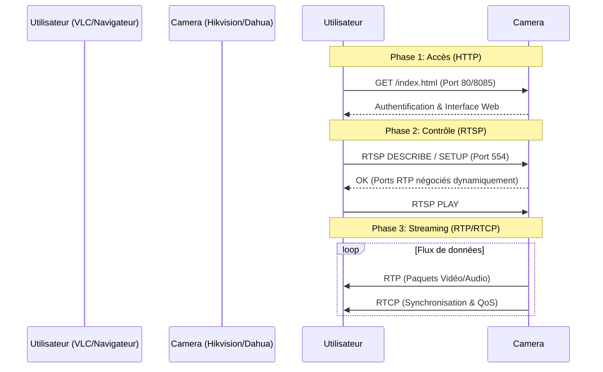

# Les Fondations de la Vidéosurveillance IP : Le Lexique des Protocoles

## 1. Introduction : L'Orchestration d'une Image

Voir une image s'afficher en direct sur un écran n'est pas le résultat d'un processus unique, mais d'une collaboration rigoureuse entre plusieurs langages techniques situés à la couche 7 (Application) du modèle OSI. La vidéo sur IP repose sur une pile de protocoles où chaque acteur remplit une mission chirurgicale. Pour l'architecte réseau, comprendre cette orchestration est la clé pour transformer un système vulnérable en une infrastructure robuste. Ce document décompose la mécanique du flux vidéo à travers trois piliers : **HTTP**, **RTSP** et **RTP**.

## 2. HTTP : Le Portier et la Configuration

Le protocole **HTTP** (_Hypertext Transfer Protocol_) agit comme le "concierge" de la caméra. Contrairement à une idée reçue, il ne transporte pas le flux vidéo brut, mais gère l'accès et l'administration.

- **Interface Web et Dashboard :** HTTP génère l'interface graphique permettant de visualiser les menus.
- **Configuration Technique :** C'est par ce canal que l'on modifie la résolution, le framerate ou les paramètres réseau.
- **Authentification :** HTTP gère l'échange initial des identifiants (généralement sur les ports 80 ou 443).

**L'œil de l'expert :** De nombreux développeurs tentent de pratiquer la "sécurité par l'obscurité" en déplaçant le port HTTP par défaut (par exemple vers le port **8085**). C'est une protection illusoire : un simple scan de ports (Nmap) révèle instantanément le service. De plus, les statistiques de terrain montrent que dans 98 % des cas, le nom d'utilisateur reste le réglage d'usine : `admin`. Le véritable verrou n'est pas le port ou l'identifiant, mais la complexité du mot de passe.

## 3. RTSP : La Télécommande d'État

Le protocole **RTSP** (_Real-Time Streaming Protocol_) est le cerveau de la session. Si HTTP est le portier, RTSP est la **télécommande intelligente**. Son rôle est d'envoyer des commandes de contrôle (Play, Pause, Describe, Setup) sans transporter l'image elle-même.

### Le concept de "Stateful" (Avec État)

Contrairement au HTTP qui est "Stateless" (chaque requête est indépendante), le RTSP est **"Stateful"**. Il maintient une session active et suit l'état de la connexion. Si la session RTSP tombe, le flux de données s'interrompt immédiatement car le serveur n'a plus d'instructions de diffusion.

**Tableau Comparatif des Rôles :**

|   |   |   |
|---|---|---|
|Caractéristique|RTSP (La Télécommande)|RTP (Le Transporteur)|
|**Fonction principale**|Négociation et contrôle du flux|Acheminement des données binaires|
|**Ports typiques**|554, 8554, 5554|Dynamiques (Négociés via RTSP)|
|**Protocole de transport**|Principalement TCP (pour les commandes)|UDP ou TCP (selon la QoS)|

**Note de l'architecte :** RTSP est le "langage universel". Même lorsque des standards modernes comme ONVIF ou PSIA sont utilisés pour la découverte, ils s'appuient presque toujours sur RTSP comme solution de repli (fallback) pour la diffusion. Une règle d'or sur le terrain : si un port ouvert se termine par "54" (554, 8554, 5554), il s'agit presque certainement d'une caméra IP.

## 4. RTP et RTCP : La Livraison de Données

Une fois la session établie par le RTSP, le protocole **RTP** (_Real-Time Transport Protocol_) prend le relais en tant que **camion de livraison**. Il transporte les paquets de données contenant les informations binaires de la vidéo (H.264/H.265) et de l'audio.

Pour garantir la fluidité, RTP travaille de concert avec **RTCP** (_Real-Time Control Protocol_). RTCP assure la **Qualité de Service (QoS)** et la synchronisation des flux. Il fournit un feedback sur la perte de paquets et la gigue (jitter), permettant au système de s'adapter aux conditions du réseau.

## 5. Analyse du Flux : Le "Handshake" Technique

Le schéma suivant illustre l'interaction séquentielle des protocoles lors d'une demande de visualisation.

**Le "Bypass" VLC :** Un aspect critique de la sécurité est qu'un utilisateur peut souvent contourner totalement l'interface HTTP (le Portier). En utilisant un lecteur comme **VLC** et une URL directe du type `rtsp://admin:mot_de_passe@IP:554/stream`, il est possible d'accéder aux images sans jamais passer par le tableau de bord de la caméra.

## 6. Synthèse et Vulnérabilités de Terrain

L'expérience montre que la sécurité des systèmes de vidéosurveillance est souvent négligée. Les marques majeures comme **Hikvision** ou **Dahua** (souvent "white-labelisées" sous d'autres noms) sont des cibles privilégiées.

- **Le fléau des mots de passe par défaut :** On estime que **10 % à 30 %** des systèmes en ligne utilisent encore des credentials d'usine comme `12345` ou `admin/admin`.
- **Accès Racine (Root) :** Via des services comme Telnet (Port 23), souvent laissé ouvert par les constructeurs pour la maintenance, un attaquant peut extraire les condensats (hashes) de mots de passe directement depuis le système de fichiers Linux de la caméra (`/etc/passwd`).

## 7. Conclusion : Le Diagnostic de l'Architecte

Comprendre cette segmentation n'est pas une simple curiosité intellectuelle, c'est un outil de diagnostic indispensable.

**Le cas classique :** Vous installez une caméra. L'interface web s'affiche parfaitement (HTTP OK), mais la fenêtre vidéo reste désespérément noire. **Le verdict :** Le portier (HTTP) a laissé passer la connexion, mais la télécommande (RTSP) ou le transporteur (RTP) est bloqué par un pare-feu ou un problème de routage sur le port 554. En maîtrisant la grammaire de ces protocoles, vous cessez de subir les pannes pour commencer à administrer réellement votre sécurité.